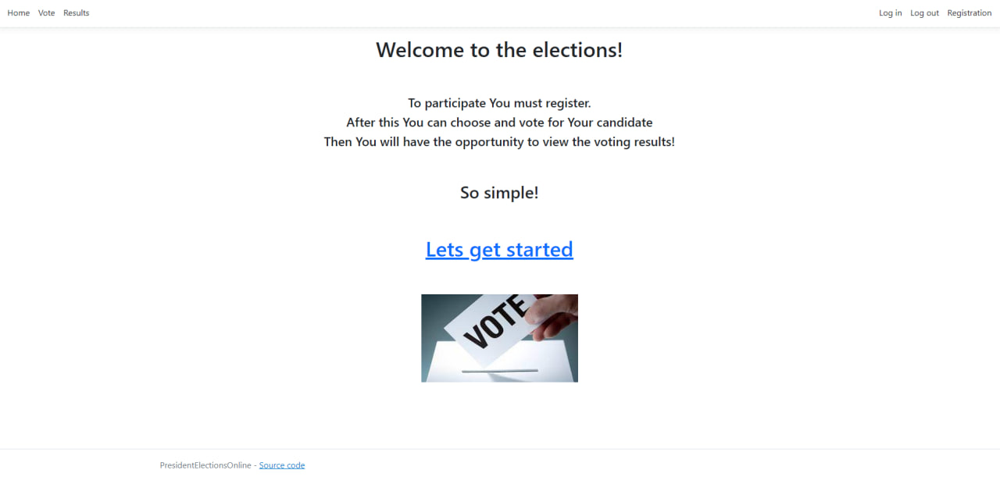

# Elections-Online

This project is a web application designed to facilitate online elections by connecting to a database. Registered users have the opportunity to cast their votes for one of three candidates or options. After voting, users can view real-time election results on the web page.

## Features of this project include:

-Registration

 

-Authentication (Login and Logout)

 

-Voting

 

-Viewing election results (displays data retrieved from the databases)

 

-Retrieving specific data from the REST API (for example, querying /api/voters/Biden returns information about users who voted for this candidate)

## Project's Stack:

-Main programming language: C#

-Main template: ASP.NET MVC

-Platform: .NET 7

-ORM (Object-Relational Mapping) framework: Entity Framework (used to connect applications with MySQL database)

-Database: MySQL

-Testing framework: XUnit Tests (used for testing the project)